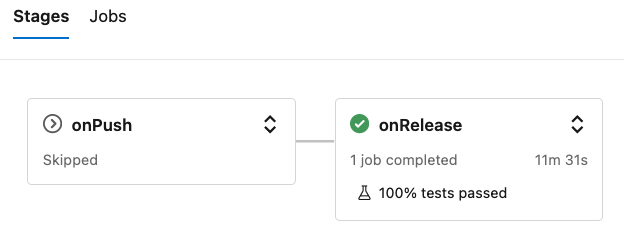

This repository contains a demo of using [Files in Repos](https://docs.databricks.com/repos/work-with-notebooks-other-files.html#work-with-python-and-r-modules) functionality with [Databricks Delta Live Tables (DLT)](https://docs.databricks.com/workflows/delta-live-tables/index.html) to perform unit & integration testing of DLT pipelines.

More detailed description is available in the blog post [Applying software development & DevOps best practices to Delta Live Table pipelines](https://www.databricks.com/blog/applying-software-development-devops-best-practices-delta-live-table-pipelines). 

TODO: add table of content

# Setup instructions

:construction: Work in progress...

:warning: Setup instructions describe process of performing CI/CD using Azure DevOps (ADO), but similar thing could be implemented with any CI/CD technology.

There are two ways of setting up everything:

1. using Terraform - it's the easiest way of getting everything configured in a short time.  Just follow instructions in [terraform/azuredevops/](terraform/azuredevops/) folder.  :warning: This doesn't include creation of release pipeline as there is no REST API and Terraform resource for it.
2. manually - follow instructions below to create all necessary objects.

## Create necessary Databricks Repos checkouts

In this example we're using three [checkouts of our sample repository](https://docs.databricks.com/repos/git-operations-with-repos.html#add-a-repo-connected-to-a-remote-repo):

1. Development: is used for actual development of the new code, running tests before committing the code, etc.
1. Staging: will be used to run tests on commits to branches and/or pull requests.  This checkout will be updated to the actual branch to which commit happened.  We're using one checkout just for simplicity, but in real-life we'll need to create such checkouts automatically to allow multiple tests to run in parallel. 
1. Production: is used to keep the production code - this checkout always will be on the `releases` branch, and will be updated only when commit happens to that branch and all tests are passed.

## Create DLT pipelines

:construction: Work in progress...

## Create ADO build pipeline

:construction: Work in progress...

The ADO build pipeline consists of the two stages:

- `onPush` is executed on push to any Git branch except `releases` branch and version tags.  This stage only runs & reports unit tests results (both local & notebooks).
- `onRelease` is executed only on commits to the `releases` branch, and in addition to the unit tests it will execute a DLT pipeline with integration test (see image).

## Create ADO release pipeline

:construction: Work in progress...

